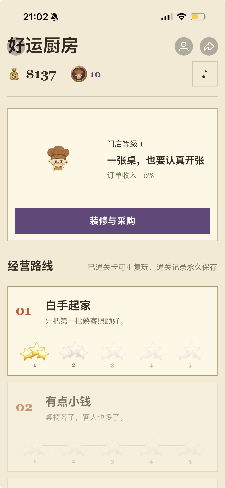
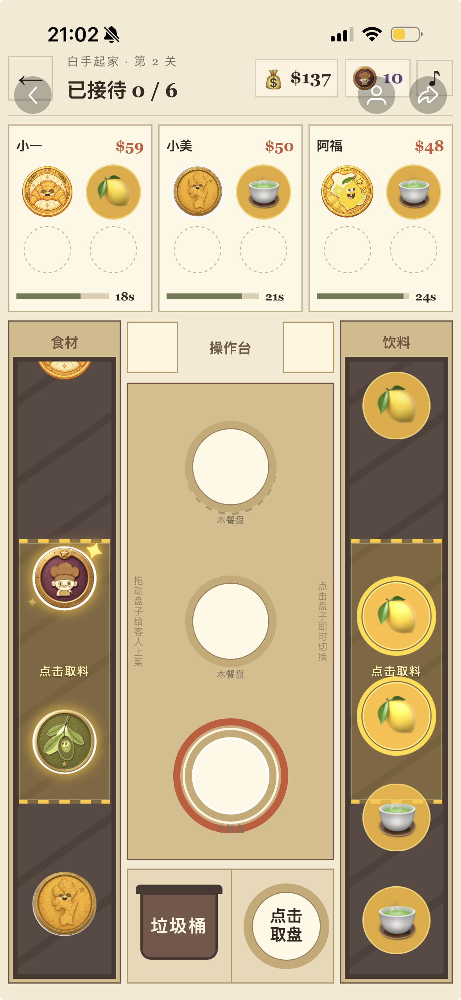

# 好运厨房 Lucky Kitchen

一款面向移动端碎片化娱乐场景的轻量经营游戏，发布于小红书 H5 预览场景。

玩家从第一关的取盘、取料、配餐和上菜开始经营餐厅，通过完成订单获得现金和厨神币，逐步解锁门店装修、餐盘、高级食材和道具。通关主线后，还可以进入“好运急单”副本，在限时和生命值规则下完成连续订单，获得额外奖励。


## 在线体验

[打开好运厨房 H5](https://lucky-kitchen-v9.netlify.app/)

建议使用手机或浏览器移动端模式体验。首次进入游戏后，点击“开始营业”即可开始第一关。

## 游戏截图

### 进入界面


### 经营主页面



### 实际操作界面



## 项目亮点

- 20 关主线经营路线，包含新手引导、星级评价和持续成长系统
- 三档难度的“好运急单”竞速副本
- 取盘、配餐、拖拽上菜、错误补救和订单结算等完整交互闭环
- 门店装修、餐盘、食材、道具和厨神币兑换等长期经营机制
- 面向移动 WebView 的触摸拖拽、页面滚动、音频播放和资源上传适配
- 使用 Codex 辅助需求拆解、规则建模、原型开发和问题排查，由人工完成玩法取舍和体验验收

## 产品思考

项目从试玩反馈中提炼出三个核心问题：收益缺少用途、失败成本较高、单局结束后缺乏持续目标。为此，我将产品目标从“完成一局订单”扩展为“短局反馈 + 经营成长 + 高阶挑战”：

1. 用现金、厨神币和门店升级赋予订单收益明确用途。
2. 用星级记录、20 关路线和道具系统建立持续目标。
3. 用“好运急单”保留高强度挑战，同时避免新玩法直接替代原有主线体验。

## 核心玩法

### 主线经营

1. 选择经营关卡。
2. 点击取盘并从食材、饮料传送带取料。
3. 按顾客订单完成配餐。
4. 将餐盘拖动到对应顾客。
5. 错误配餐可以放入垃圾桶重做，完成订单后获得现金和星级评价。

### 经营成长

- 现金：用于装修门店、购买餐盘、采购高级食材和购买道具。
- 厨神币：可兑换现金，也可用于急单副本复活。
- 星级：根据完成的顾客数量获得一至三星评价。
- 持久化：使用 `localStorage` 保存现金、厨神币、通关数、星级、装修、餐盘、食材、道具和急单记录。

### 好运急单

- 顺手急单、特快急单、火烧眉毛单三档难度
- 传送带速度和食材币密度逐步提升
- 点错或超时会损失生命值
- 每局最多复活一次
- 完成挑战后获得额外现金和厨神币

## 技术栈

- HTML
- CSS
- 原生 JavaScript
- Web Audio API
- `localStorage`

项目不依赖后端和第三方运行时，适合直接在移动端浏览器或 WebView 中预览。

## 本地运行

### 方式一：直接打开

直接用浏览器打开 `index.html`。

### 方式二：启动本地静态服务器

```bash
python3 -m http.server 8000
```

然后访问：

```text
http://localhost:8000
```

## AI 协作开发方式

我把 AI 当作执行和排查工具，而不是产品决策的替代者。

### AI 主要协助的工作

- 将自然语言玩法想法拆成状态、事件、奖励和失败分支
- 生成和重构 HTML、CSS、JavaScript 初版实现
- 根据截图或体验问题定位 DOM、CSS 和事件处理逻辑
- 辅助排查音频播放、触摸拖拽和状态持久化问题

### 人工负责的判断

- 定义用户问题和核心玩法目标
- 决定奖励、难度、复活成本和成长节奏
- 通过真实手机预览判断引导、误触、滚动和音效体验
- 检查 AI 是否修改了错误的状态边界或引入重复事件
- 验证正式包是否符合平台文件类型限制

### 每轮迭代流程

```text
提出体验问题
  → 拆解为可观察变量
  → 让 AI 提出或实现候选方案
  → 只修改一个主要变量
  → 语法检查与关键路径回归
  → 手机预览
  → 保留或回滚
```

## 发布适配

项目针对移动端 WebView 做了以下处理：

- 使用 `touch-action` 和事件处理减少拖拽时的页面滚动
- 通过用户手势触发 Web Audio，适配移动端自动播放限制
- 将音乐资源以内嵌 JavaScript 形式加载，减少平台文件类型限制带来的问题
- 正式发布前检查 HTML、CSS、JavaScript、PNG 等文件扩展名
- 使用 `localStorage` 保存进度，并为旧字段提供默认值和迁移逻辑

## 项目验证与后续计划

当前版本主要通过真实手机预览、关键路径回归和发布包审计进行验证。项目暂未接入完整埋点，因此不会把未测量的留存或转化提升写成结果。

后续可以继续补充：

- 首关完成率、引导跳过率和错误类型埋点
- 急单进入率、订单完成率、点错次数和复活率看板
- 声音反馈的视觉替代和更多可访问性支持
- 音频转码、资源审计和压缩包生成的一键构建脚本
- 将关卡和道具配置从 JavaScript 拆分到 JSON

## 项目结构

```text
.
├── index.html                         # 页面结构与游戏界面
├── management.css                     # 移动端界面与交互样式
├── management.js                      # 主线经营、商店、急单和持久化逻辑
└── assets/
    ├── audio/                         # 背景音乐
    ├── coins/                         # 食材、饮料和厨神币素材
    └── *.png                          # 厨师、门店和界面素材
```

## 版权与素材说明

本仓库用于个人作品展示。发布前请确认图片、音乐和字体素材的使用权限；如需公开仓库，请只保留拥有发布权限的素材。
